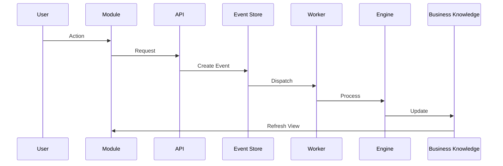

# Kodem System Architecture

Version: 1.0

---

# Purpose

This document defines the architecture of the Kodem platform.

It is the single source of truth for architectural decisions.

Every major implementation should align with the principles defined here.

When architecture and implementation diverge, architecture must be reviewed before code is changed.

---

# Vision

Kodem is an AI-powered Business Operating System.

It helps businesses understand themselves, continuously improve, and make better decisions.

Unlike traditional CRMs, dashboards or reporting systems, Kodem builds a continuously evolving understanding of each business.

This understanding is represented by the Business Knowledge Model (BKM).

Everything in the platform exists to improve that understanding.

---

# Core Design Principles

## Platform First

Kodem is a multi-tenant SaaS platform.

The Platform provides shared capabilities.

Businesses operate inside isolated Workspaces.

---

## Workspace Centric

Everything belongs to a Workspace.

The Workspace represents a single business.

Modules, Events, Members, Assets and Business Knowledge all belong to the Workspace.

---

## Business Knowledge First

Business Knowledge is the core asset of Kodem.

Data is temporary.

Knowledge compounds.

Every interaction should improve the Business Knowledge Model.

---

## Intelligence Before Interfaces

Users do not interact directly with Engines.

Users interact with Modules.

Modules consume intelligence produced by Engines.

---

## Event Driven

Every meaningful business action generates an Event.

Events drive platform intelligence.

Events are immutable.

---

## AI is Infrastructure

AI providers are implementation details.

Business logic must never depend on a specific AI model.

All AI interactions happen through the AI Gateway.

---

# High Level Architecture

```mermaid
flowchart TD

Platform

Platform --> Workspace

Workspace --> BusinessKnowledge

BusinessKnowledge --> Engines

Engines --> Modules

Modules --> Users

Platform --> AI Gateway

Platform --> Integrations

AI Gateway --> Engines

Integrations --> BusinessKnowledge
```

---

# Platform Layer

The Platform is responsible for global services shared by every Workspace.

Responsibilities:

- Authentication
- Authorization
- Subscription Management
- Module Catalog
- Integration Catalog
- AI Gateway
- Feature Flags
- Usage Tracking
- Logging
- Monitoring
- Notifications
- Global Configuration

The Platform never stores business-specific logic.

---

## Platform Rules

There is exactly one Platform.

The Platform owns infrastructure.

The Platform never owns business data.

---

# Workspace Layer

A Workspace represents one business.

Everything owned by a customer belongs to exactly one Workspace.

A Workspace contains:

- Business Profile
- Members
- Permissions
- Business Knowledge
- Events
- Assets
- Module Configuration
- AI Configuration

---

## Workspace Rules

Everything belongs to a Workspace.

Workspace isolation is mandatory.

No Workspace may access another Workspace's data.

---

# Business Knowledge Model (BKM)

The Business Knowledge Model is the intelligence layer of Kodem.

It represents everything the platform knows about a business.

Examples:

- Facts
- Relationships
- Goals
- Products
- Services
- Customers
- Audience
- Observations
- Hypotheses
- Insights
- Recommendations

The BKM continuously evolves.

It is never considered complete.

---

## BKM Rules

Business Knowledge is always the source of truth.

Modules never own business knowledge.

Engines continuously enrich Business Knowledge.

---

# Engines

Engines continuously analyze Business Knowledge and Events.

Current Engines:

- Discovery Engine
- Learning Engine
- Insight Engine
- Recommendation Engine
- Rule Engine

Future engines may be added without changing platform architecture.

---

## Engine Responsibilities

Read Business Knowledge.

Analyze Events.

Generate Observations.

Generate Insights.

Generate Recommendations.

Update Business Knowledge.

---

## Engine Rules

Engines never know UI.

Engines never know HTTP.

Engines never know React.

Engines never depend on Nest Controllers.

Engines must remain reusable.

---

# Modules

Modules provide business capabilities.

Examples:

Core

- CRM
- Digital Card

Premium

- Marketing
- Campaigns
- Insights
- Automation
- Booking

Modules expose capabilities.

Modules never own business knowledge.

---

## Module Rules

Modules consume Business Knowledge.

Modules create Events.

Modules never duplicate platform intelligence.

---

# Event Architecture

Events are immutable records describing business activity.

Examples:

Lead.Created

Lead.Qualified

Campaign.Published

Recommendation.Accepted

BusinessProfile.Updated

Events become the historical memory of the Workspace.

---

## Event Flow



---

# AI Architecture

AI is accessed only through the AI Gateway.

The Gateway selects providers according to Workspace strategy.

Strategies:

- Platform Managed
- Preferred Provider
- Bring Your Own AI

Future strategies can be added without affecting Engines.

---

## AI Rules

AI never defines business rules.

AI produces structured outputs.

Business logic remains deterministic.

---

# Data Ownership

Platform owns:

- Infrastructure
- AI
- Integrations
- Authentication

Workspace owns:

- Business Data
- Events
- Business Knowledge
- Assets
- Configuration

Modules own:

Nothing.

Modules expose functionality.

Business Knowledge remains the source of truth.

---

# Request Lifecycle

User

↓

Module

↓

API

↓

Event

↓

Worker

↓

Engine

↓

Business Knowledge

↓

Module Refresh

---

# Nx Mapping

```text
apps/
  web/
  marketing/
  api/
  worker/

libs/
  platform/
  workspace/
  engines/
  modules/
  integrations/
  ai/
  database/
  shared/
```

---

# Architecture Constraints

The following are forbidden:

- Business logic inside UI
- Engine logic inside Controllers
- Direct Engine calls from UI
- Business logic inside AI prompts
- Modules owning business knowledge
- Workspace-to-Workspace communication

---

# Guiding Question

Before implementing any feature ask:

Does this improve the platform's understanding of the business?

If not, reconsider the implementation.